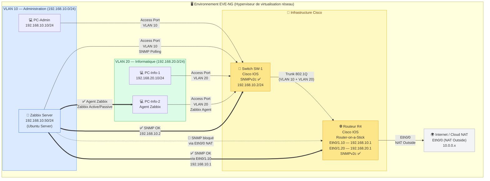
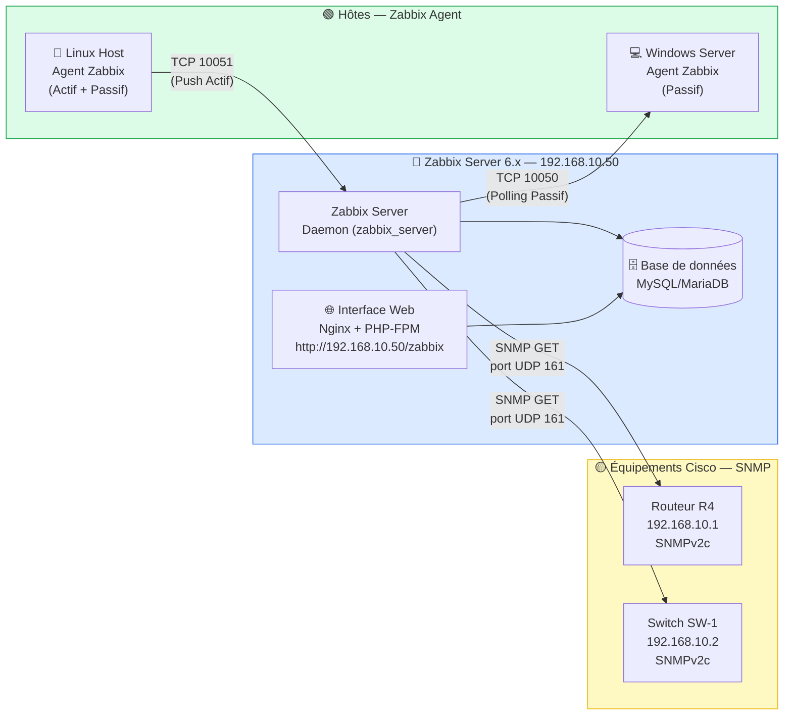

# 🏗️ ARCHITECTURE.md — Infrastructure de Supervision Centralisée
## Projet : Zabbix Network Monitoring sous EVE-NG
**Auteur :** Mamadou Aliou Barry | L2 RSS — SUP de CO Dakar (SET) | Stage 2026

---

## Table des matières

1. [Vue d'ensemble de l'infrastructure](#1-vue-densemble-de-linfrastructure)
2. [Schéma de l'architecture réseau EVE-NG](#2-schéma-de-larchitecture-réseau-eve-ng)
3. [Plan d'adressage IP](#3-plan-dadressage-ip)
4. [Configuration Cisco — Routeur R4](#4-configuration-cisco--routeur-r4)
5. [Configuration Cisco — Switch SW-1](#5-configuration-cisco--switch-sw-1)
6. [Architecture de Supervision Zabbix](#6-architecture-de-supervision-zabbix)
7. [Résolution du problème NAT & SNMP](#7-résolution-du-problème-nat--snmp)
8. [Captures d'écran](#8-captures-décran)

---

## 1. Vue d'ensemble de l'infrastructure

L'infrastructure déployée sous **EVE-NG** simule un environnement réseau d'entreprise complet. Elle met en œuvre :

- Un **routage inter-VLAN** via la technique *Router-on-a-Stick* (sous-interfaces dot1Q) sur le Routeur **R4**
- Deux **VLANs** (VLAN 10 – Administration, VLAN 20 – Informatique) segmentés sur le Switch **SW-1**
- Un **serveur Zabbix 6.x** sous Linux collectant les métriques via **SNMPv2c** (équipements Cisco) et **Zabbix Agent** (machines Windows/Linux)
- La résolution d'un **blocage SNMP causé par le NAT** sur l'interface `Ethernet0/0`

---

## 2. Schéma de l'architecture réseau EVE-NG



> **Légende :**
> - `==>` Flux de supervision **actif** (fonctionnel)
> - `-.->` Flux **bloqué** par le NAT (problème résolu via Eth0/1.10)
> - Les pastilles **SNMP ✅** indiquent que la collecte Zabbix est opérationnelle

---

## 3. Plan d'adressage IP

| Équipement | Interface | Adresse IP | Masque | Rôle | VLAN |
|---|---|---|---|---|---|
| **Routeur R4** | `Ethernet0/1.10` | `192.168.10.1` | `/24` | Passerelle VLAN 10 + collecte SNMP | VLAN 10 |
| **Routeur R4** | `Ethernet0/1.20` | `192.168.20.1` | `/24` | Passerelle VLAN 20 | VLAN 20 |
| **Routeur R4** | `Ethernet0/0` | `10.0.0.x` (DHCP) | `/24` | NAT Outside → Internet | — |
| **Switch SW-1** | `VLAN 10 (SVI)` | `192.168.10.2` | `/24` | Interface de gestion + SNMP | VLAN 10 |
| **Zabbix Server** | `eth0` | `192.168.10.50` | `/24` | Serveur de supervision | VLAN 10 |
| **PC-Admin** | `eth0` | `192.168.10.10` | `/24` | Poste administrateur | VLAN 10 |
| **PC-Info** | `eth0` | `192.168.20.10` | `/24` | Poste utilisateur + Agent | VLAN 20 |

**Pools DHCP configurés sur R4 :**
```
Pool VLAN10 : 192.168.10.100 – 192.168.10.200  | Gateway: 192.168.10.1 | DNS: 8.8.8.8
Pool VLAN20 : 192.168.20.100 – 192.168.20.200  | Gateway: 192.168.20.1 | DNS: 8.8.8.8
```

---

## 4. Configuration Cisco — Routeur R4

### 4.1 Sous-interfaces Router-on-a-Stick (dot1Q)

```cisco
! Interface physique parente — SANS adresse IP
interface Ethernet0/1
 no ip address
 no shutdown
 duplex full
!
! Sous-interface VLAN 10 — Passerelle Administration
interface Ethernet0/1.10
 encapsulation dot1Q 10
 ip address 192.168.10.1 255.255.255.0
 ip nat inside
!
! Sous-interface VLAN 20 — Passerelle Informatique
interface Ethernet0/1.20
 encapsulation dot1Q 20
 ip address 192.168.20.1 255.255.255.0
 ip nat inside
!
! Interface WAN — NAT Outside (attention : SNMP bloqué ici !)
interface Ethernet0/0
 ip address dhcp
 ip nat outside
 no shutdown
```

### 4.2 Configuration SNMPv2c

```cisco
! Activation SNMP — Community lecture seule "public"
snmp-server community public RO
snmp-server location "EVE-NG Lab - SUP de CO Dakar"
snmp-server contact "Aliou Barry - Admin Reseau"

! Autoriser Zabbix Server à interroger via SNMP
snmp-server host 192.168.10.50 version 2c public
```

> ⚠️ **Point critique :** La communauté SNMP doit être accessible depuis `192.168.10.50` (Zabbix) via l'interface `Eth0/1.10`. Le NAT sur `Eth0/0` bloquait les requêtes SNMP (voir [Section 7](#7-résolution-du-problème-nat--snmp)).

### 4.3 DHCP et NAT/PAT

```cisco
! Pools DHCP
ip dhcp pool VLAN10
 network 192.168.10.0 255.255.255.0
 default-router 192.168.10.1
 dns-server 8.8.8.8

ip dhcp pool VLAN20
 network 192.168.20.0 255.255.255.0
 default-router 192.168.20.1
 dns-server 8.8.8.8

ip dhcp excluded-address 192.168.10.1 192.168.10.99
ip dhcp excluded-address 192.168.20.1 192.168.20.99

! NAT PAT — Overload sur interface WAN
ip nat inside source list NAT_ACL interface Ethernet0/0 overload

! ACL pour le NAT
ip access-list standard NAT_ACL
 permit 192.168.10.0 0.0.0.255
 permit 192.168.20.0 0.0.0.255

! Route par défaut vers Internet
ip route 0.0.0.0 0.0.0.0 Ethernet0/0
```

---

## 5. Configuration Cisco — Switch SW-1

```cisco
! Création des VLANs
vlan 10
 name ADMINISTRATION
vlan 20
 name INFORMATIQUE

! Ports d'accès VLAN 10 (Fa0/1 à Fa0/12)
interface range FastEthernet0/1 - 12
 switchport mode access
 switchport access vlan 10
 no shutdown

! Ports d'accès VLAN 20 (Fa0/13 à Fa0/24)
interface range FastEthernet0/13 - 24
 switchport mode access
 switchport access vlan 20
 no shutdown

! Port Trunk vers Routeur R4 (Gi0/1)
interface GigabitEthernet0/1
 switchport trunk encapsulation dot1q
 switchport mode trunk
 switchport trunk allowed vlan 10,20
 no shutdown

! Interface de gestion SVI VLAN 10
interface Vlan10
 ip address 192.168.10.2 255.255.255.0
 no shutdown

ip default-gateway 192.168.10.1

! SNMP sur le Switch
snmp-server community public RO
snmp-server host 192.168.10.50 version 2c public
```

---

## 6. Architecture de Supervision Zabbix



### Templates Zabbix utilisés

| Hôte | Template Zabbix | Méthode | Items clés supervisés |
|---|---|---|---|
| Routeur R4 | `Cisco IOS SNMPv2` | SNMP v2c | CPU, interfaces, trafic, uptime |
| Switch SW-1 | `Cisco IOS SNMPv2` | SNMP v2c | Ports, bande passante, erreurs |
| Windows Host | `Windows by Zabbix Agent` | Agent (passif) | CPU, RAM, disque, services |
| Linux Host | `Linux by Zabbix Agent` | Agent (actif) | CPU, RAM, load average, réseau |

### Triggers (Alertes) configurés

| Trigger | Sévérité | Condition |
|---|---|---|
| `{HOST} est injoignable` | **Disaster** | ICMP timeout > 3 essais |
| `CPU utilisation > 80%` | **High** | CPU avg > 80% pendant 5 min |
| `Interface {#IFNAME} est DOWN` | **High** | `ifOperStatus` = down |
| `Espace disque < 10%` | **Warning** | Disque libre < 10% |
| `RAM disponible < 10%` | **Warning** | Mémoire libre < 10% |

---

## 7. Résolution du problème NAT & SNMP

### Problème rencontré

Lors de la phase d'intégration Zabbix, les équipements Cisco (R4 et SW-1) apparaissaient en **rouge** dans l'interface Zabbix avec le statut `SNMP agent is not available`.

### Analyse du blocage

```
Zabbix Server (192.168.10.50)
        │
        │  SNMP GET → 10.0.0.x (adresse NAT de R4)
        ▼
  Ethernet0/0 ← ip nat outside   ← ❌ BLOQUÉ
       R4
  Ethernet0/1.10 ← ip nat inside  ← ✅ ACCESSIBLE (192.168.10.1)
```

**Cause racine :** Zabbix tentait de joindre R4 via son adresse NAT (`Ethernet0/0`). Or, `ip nat outside` sur cette interface intercepte et transforme les paquets SNMP entrants, rendant la réponse incohérente ou perdue.

### Solution appliquée

```
1. Modification de l'hôte R4 dans Zabbix :
   → Interface SNMP : 192.168.10.1  (Eth0/1.10 — ip nat inside)
   ✅ Résultat : collecte SNMP opérationnelle

2. Correction du Duplex Mismatch sur Eth0/0 :
   → Ajout de "duplex full" sur Ethernet0/0 et Ethernet0/1
   ✅ Résultat : stabilité de la liaison, fin des erreurs d'interface
```

**Leçon retenue :** Dans un environnement NAT, toujours configurer Zabbix pour joindre les équipements via leur adresse IP **interne** (`ip nat inside`), jamais via l'interface NAT outside.

---

## 8. Captures d'écran

Les captures ci-dessous documentent les étapes clés du projet. Elles sont stockées dans le dossier `docs/captures/` du dépôt.

### 8.1 Topologie EVE-NG


> **Description :** Vue de la topologie réseau dans EVE-NG — Routeur R4, Switch SW-1, Zabbix Server et les hôtes clients interconnectés.

---

### 8.2 Configuration SNMP sur R4 (CLI Cisco)


> **Description :** Sortie de `show running-config | include snmp` sur R4 confirmant l'activation de SNMPv2c avec la community `public`.

---

### 8.3 Dashboard Zabbix — Vue globale du parc


> **Description :** Tableau de bord Zabbix affichant l'état de santé global — pastilles vertes (SNMP + Agent) pour tous les équipements supervisés.

---

### 8.4 Hôte R4 dans Zabbix — Statut SNMP vert ✅


> **Description :** Fiche de l'hôte R4 dans Zabbix. Interface SNMP configurée sur `192.168.10.1`, statut disponible (pastille verte).

---

### 8.5 Graphique de bande passante — Interface R4


> **Description :** Graphique Zabbix du trafic entrant/sortant sur l'interface `Ethernet0/1` de R4, collecté via l'OID `ifInOctets` / `ifOutOctets`.

---

### 8.6 Trigger déclenché — Test d'injoignabilité


> **Description :** Déclenchement du trigger `{HOST} est injoignable` (sévérité Disaster) lors d'un test d'extinction d'un équipement. Détection en < 30 secondes.

---

### 8.7 Agent Zabbix — Hôte Windows supervisé


> **Description :** Supervision d'un hôte Windows via Zabbix Agent (passif). Métriques CPU, RAM et espace disque visibles en temps réel.

---

### 8.8 Configuration MobaXterm — Accès CLI Cisco réel


> **Description :** Session MobaXterm/PuTTY connectée en console sur le Switch SW-1 physique de Sup de Co — configuration des VLANs et du Trunk.

---

## 📁 Structure des fichiers dans ce dépôt

```
ZabbixNetworkMonitoring/
│
├── README.md                          ← Présentation du projet
├── ARCHITECTURE.md                    ← Ce fichier — Architecture complète
├── GIT_GUIDE.md                       ← Guide Git/GitHub du projet
├── .gitignore
│
├── configs/
│   └── cisco/
│       ├── R4_running-config.txt      ← Config complète Routeur R4
│       └── SW-1_running-config.txt    ← Config complète Switch SW-1
│
├── zabbix/
│   ├── templates/
│   │   └── zbx_template_cisco_ios.xml ← Template exporté depuis Zabbix
│   └── dashboards/
│       └── dashboard_supervision.json ← Export JSON du dashboard
│
├── docs/
│   ├── captures/                      ← 📸 Captures d'écran (voir Section 8)
│   │   ├── 01_eve-ng_topologie.png
│   │   ├── 02_config_snmp_r4.png
│   │   ├── 03_zabbix_dashboard_global.png
│   │   ├── 04_zabbix_host_r4_snmp_ok.png
│   │   ├── 05_zabbix_graph_bandwidth_r4.png
│   │   ├── 06_zabbix_trigger_unreachable.png
│   │   ├── 07_zabbix_agent_windows.png
│   │   └── 08_mobaxterm_cisco_cli.png
│   └── guide_exploitation.md          ← Guide d'utilisation Zabbix
│
└── scripts/
    └── check_snmp.sh                  ← Script de test SNMP depuis Linux
```

---

*Documentation rédigée dans le cadre du Stage L2 — Réseaux, Systèmes & Sécurité*
*SUP de CO Dakar — School of Engineering and Technology — Septembre 2026*
